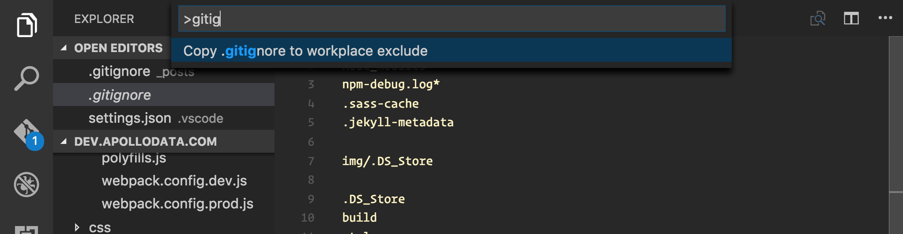

# ignore-gitignore

A Visual Studio Code extension to use your `.gitignore` file to set ignored files in your editor.

### Usage

After installing, open the command palette (CMD-shift-P on mac) and search for `gitignore`:

Then, select that option and the `"search.exclude"` and `"files.exclude"` sections of your workplace configuration will be overwritten with the values from any `.gitignore` files in your project.

Note that `.gitignore` files in nested directories are used too, and all of those are merged into one configuration.

### Docs

The command added by this package lives under `extension.ignoreGitignore`, in case you want to use it in a script or hotkey.
